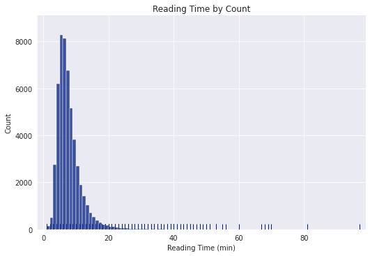
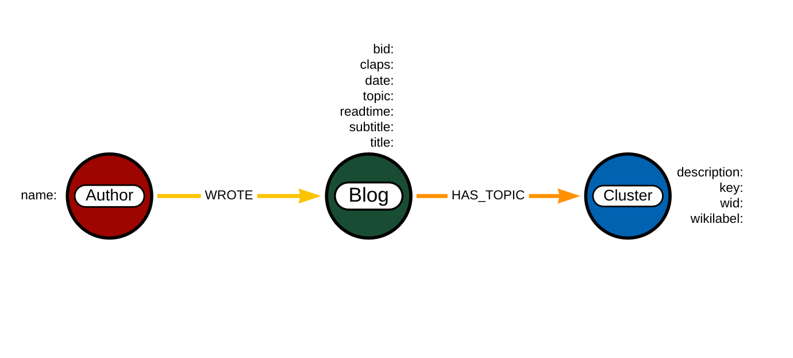

# Knowledge Graph for Towards Data Science Blogs

## Data Collection

I am interested in analyzing the blog posted on Towards Data Science (TDS) Medium publication from 2018 to 2022. To retrieve the articles dated during a specific period, we need to understand the URL's date format. For example, to access all TDS posts from February 22, 2022 we use: `towardsdatascience.com/archive/2022/02/22`. 

Towards Data Science's earliest publications date back to 2010, with monthly publication grouping commencing in 2015. During the first couple of years, certain months had no published articles. 

Since numerous posts are behind Medium's paywall, I only extract publicly accessible information, including the title and subtitle, along with specific metadata.

My methodology entails using a `Selenium webdriver` to retrieve data from the website and `BeautifulSoup` to extract the pertinent information while cleaning it up. The webdriver navigates through each daily list, saving the articles in monthly chunks. We combine these csv files into one by utilizing the `glob` library in Python. 

📘 The Jupyter notebook containing the code for these procedures: **1.dataCollection**.


💡**Challenges**💡

Retrieving the entire dataset is a slow process that takes several hours. We address this challenge by writing functions that retrieve only one month at a time.

***

## Data Preprocessing and Exploration

The data collected appears to be quite clean in its current state and can be easily prepared for analysis using Pandas with just a few steps. Below is a raw data entry:


The data consists of more than 52,000 blogs authored by 12,000 writers during the time period spanning January 2018 to December 2022.


To make the data more manageable, the following steps were taken:

- The 'author_url' column was dropped.
- Duplicate titles were removed.
- Dates, claps, responses, and reading time were parsed.
- Article and story identifiers were extracted.
- A combined text field containing the title and subtitle was created.

As a result of these steps, the entries now appear as follows:


***

During my initial data exploration, I was particularly interested in the reading time of blog posts, as I personally prefer articles under 10 minutes long. I discovered that the average reading time is approximately 7 minutes, and 75% of the blogs have a reading time of less than 9 minutes. While there are longer posts, with 134 blogs exceeding 30 minutes in length, the longest post has a reading time of 97 minutes.  I was surprised to find a podcast created by an user, and the 60 podcasts account for some of the longer reading times.



In addition to reading time, another numerical attribute of interest is the number of claps received by each article, although this is a subjective metric that can be affected by factors such as the age of the article. Interestingly, there were no blog posts with 10,000 claps or more in the years 2021-2022. The most highly clapped article dates back to 2018, titled [Why so many data scientists are leaving their jobs](ttps://towardsdatascience.com/why-so-many-data-scientists-are-leaving-their-jobs-a1f0329d7ea4) and received an impressive 52,000 claps and 307 responses. 


Despite this, it appears that people generally do not interact with blog writers very often, with 75% of articles receiving two or fewer responses. Only 467 posts received more than 20 responses, while half of the posts received no responses at all.


📘📘The details of all these steps can be found in the two notebooks: **2.dataPreprocessing** and **3.dataExploration**.


💡**Challenges**💡

None for this steps.

***

## Topic Modeling with HDBSCAN

We will now put our data through an NLP pipeline that involves clustering contextual embeddings for topic modeling, extracting relevant keywords, and linking these topics to related information in Wikipedia. A diagram of this pipeline is provided below:


### Create 768-dimensional contextual BERT embeddings for the corpus documents

To extract additional information from each blog, the title and subtitle of each are concatenated to obtain the corpus documents. We use pretrained sentence transformers from HuggingFace.

```
from sentence_transformers import SentenceTransformer

model = SentenceTransformer('all-mpnet-base-v2')
df['corpus_embeddings'] = df['corpus'].apply(lambda x: model.encode(x))
```

### Reduce the vectors to 50-dimensions

Clustering algorithms perform more effectively on lower dimensional vectors. To accomplish this, we utilize UMAP, a high-performing algorithm for dimension reduction. 

```
import umap.umap_ as umap

# Reduce the 768-dimv ectors to 50-dim vectors
embeddings = umap.UMAP(n_neighbors=15, n_components=50, metric='cosine') \
                 .fit_transform(list(df.corpus_embeddings))

# Add the reduced vectors to the dataframe
df['corpus_umap'] = embeddings.tolist()
```

### Cluster the 50-dimensional vectors with HDBSCAN

HDBSCAN (Hierarchical Density-Based Spatial Clustering of Applications with Noise) is a density-based clustering algorithm that can identify clusters of varying shapes and sizes in noisy data. It uses a hierarchical approach to build a cluster hierarchy and can automatically determine the number of clusters in the data.

The HDBSCAN can create either hard clustering (each point is assigned to a cluster) or soft clustering (where points are assigned vectors of probabilities). The algorithms are different and they produce different results. 

Initialize the clustering model:

```
import hdbscan

clusterer = hdbscan.HDBSCAN(algorithm='best', prediction_data=True,
                            min_cluster_size=100,
                            cluster_selection_epsilon = .1,
                            min_samples=1, 
                            metric='euclidean',
                            cluster_selection_method='leaf')
```

Then we fit the data and create the two sets of clusters:
```
# Fit the data
clusterer.fit(embeddings)

# Add hard clusters to the data
df['hard_labels'] = clusterer.labels_.tolist()

# Create soft clusters
soft_clusters = hdbscan.all_points_membership_vectors(clusterer)

# Add the soft cluster information to the data
closest_clusters = [np.argmax(x) for x in soft_clusters]
df['soft_labels'] = closest_clusters
```

There are 131 hard clusters created, which can be visualized in 2-dimensions as follows:


Hard clustering has a drawback in that it often produces a large noise cluster consisting of data points that are not assigned to any cluster. In our case, this noise cluster contains almost one third of the data, specifically 17476 blog posts. The size of the noise cluster is affected by two parameters: `min_cluster_size` and `min_samples`. The former determines the minimum size of a cluster and the number of resulting clusters. Increasing `min_cluster_size` results in fewer blogs being classified as noise. The latter parameter is less intuitive and provides a measure of how conservative you want you clustering to be. Decreasing `min_samples` reduces the size of the noise cluster. Finding the right balance between these two parameters can be challenging. However, since our goal is to identify finer-grained clusters, we chose the soft clustering approach. By setting `prediction_data`=True, the algorithm collects all the necessary data to build prediction vectors for each blog post, and assigns each post to a cluster. This approach eliminates the need for a noisy cluster.

There are 140 soft clusters created, with the largest one containing 1084 blog posts.

💡**Challenges**💡

When applying hard clustering with HDBSCAN, approximately one third of the data is labeled as noise. One way to reduce the size of the noise cluster is to increase the minimum cluster size while maintaining min_samples=1 as the second parameter. However, we opted for a soft clustering approach, which assigns blog posts to clusters based on probabilities rather than strict membership.

***

## Extract Keyphrases with keyBERT

n order to generate topic labels, we utilize keyBERT as follows: for each topic, we aggregate all the corpus entries assigned to that topic into a single document. We then extract meaningful keywords from each of these combined documents.

```
from keybert import KeyBERT
from keyphrase_vectorizers import KeyphraseCountVectorizer

# Create a single combined document for each cluster 
combined_df = df[['corpus', 'soft_labels']].copy()
combined_per_topic = combined_df \
            .groupby(['soft_labels'], as_index=False) \
            .agg({'corpus': ' '.join})

# Instantiate the model and the vectorizer
vectorizer = KeyphraseCountVectorizer()
kw_model = KeyBert()

# Function to extract keywords from the text
def extract_keys(text):
    keywords = kw_model.extract_keywords(text, vectorizer=vectorizer,
                                         use_mmr=True)
    return keywords

# Extract keywords for each cluster
combined_per_topic['keywords'] = combined_per_topic['corpus'] \
            .apply(lambda x: extract_keys(x))
```

Here is an example of an output: 


By using the KeyphraseCountVectorizer (instead of chosing n-grams) we extract chunks, which have a variable token length, and avoid truncateing meaningful key phrases. Once the keywords have been extracted and the output has been parsed such that each keyword appears in a separate column, we obtain:


💡**Challenges**💡

It is typical to encounter duplicated words as keywords and observe overlap among the top five outputs. To introduce greater diversity, we can set `use_mmr=True`, where MMR refers to Maximal Marginal Relevance. However, selecting an appropriate value for the `diversity` parameter can be challenging, as a value that is too high may result in words that do not accurately represent the topics of the cluster.

***

## Entity Linking with spaCy

We use the pre-trained Entity Linker model in spaCy. It identifies entities in text and links them to relevant entities in a knowledge base (downloaded Wikipedia pages), enabling the system to extract structured information from unstructured text, allowing for better information retrieval, entity disambiguation, and knowledge extraction. 


```
import spacy  

# Initialize the language model
nlp = spacy.load("en_core_web_md")

# Add to the pipeline 
nlp.add_pipe("entityLinker", last=True)

def get_linked_info(keyphrase):
    '''
    Function to extract linked information from Wikidata.
    INPUT:
        keyphrase (str)
    OUTPUT:
        linked_info (list)
    '''
    doc = nlp(keyphrase)
    if len(doc._.linkedEntities)>0:
        ent = doc._.linkedEntities[0]
        descrip = ent.get_description() # returns description from Wikidata
        wid = ent.get_id() # returns Wikidata ID
        wikilabel = ent.get_label() # returns Wikidata label
        linked_info = [descrip, wid, wikilabel]
    else:
        linked_info = ['no description','000', 'no_label']
    return linked_info

# Get the metadata for each of the key columns
key_columns = ['key1', 'key2', 'key3', 'key4', 'key5']
for col in key_columns:
    meta_col = f'meta_{col}'
    df[meta_col] = df[col].apply(lambda x: get_linked_info(x))

# Extract each metadata keyword in a separate column 
for col in key_columns:
    meta_key = f'meta_{col}'
    meta_columns = [f'{meta_key}_description', f'{meta_key}_wid', f'{meta_key}_wikilabel']
    explode_df = pd.DataFrame(df[meta_key].to_list(), columns=meta_columns)
    df = pd.concat([df, explode_df], axis=1)
```

Here is a sample output:

```
get_linked_info("machine learning")
['branch of statistics and computer science, which studies algorithms 
and architectures that learn from observed facts', 2539, 'machine learning']
```

📘 The NLP pipeline stages and all the code can be found in **4.topicModelingExtraction** Jupyter notebook.

💡**Challenges**💡

Some of the information that is linked by the entity linker may not be relevant or may be incorrectly attributed to our topics. Additionally, while the module can also extract super and sub-entities, we made the decision not to include this extra information in order to keep the knowledge graph at a manageable size.


***
***

## Build and Analyze a Knowledge Graph

Once the data is processed and save, I will build a knowledge graph in Neo4j Desktop that has the following model:



I will skip the details of setting the Neo4j Desktop here, these can be found on Neo4j website. In order to proceed, we need a running empty Graph DBMS which was enhanced with APOC and Graph Data Science pluggins. A lot of my work here was inspired by this [Blog](https://medium.com/swlh/network-analysis-of-arxiv-dataset-to-create-a-search-and-recommendation-engine-of-articles-cd18b36a185e) written by Tomaz Bratanic.

We also import the data as pandas dataframes: `df_blogs` (contains the authors, blogs and the cluster numbers) and `df_meta` (contains the cluster keyphrases and the linked information).

We first establish the connection to the running database:

```
from neo4j import GraphDatabase
driver = GraphDatabase.driver('bolt://localhost:7687', auth=('neo4j', 'mediumdata'))
```

and we create a simple function to parse the Cypher queries in the Jupyter notebook:

```
def read_query(query):
    with driver.session() as session:
        result = session.run(query)
        return pd.DataFrame([r.values() for r in result], columns=result.keys())
```

### Build the Knowledge Graph

We first have to create uniqueness constraints for the nodes:

```
with driver.session() as session:
    session.run('CREATE CONSTRAINT blogs IF NOT EXISTS FOR (b:Blog) REQUIRE b.story_id IS UNIQUE;')
    session.run('CREATE CONSTRAINT authors IF NOT EXISTS FOR (a:Author) REQUIRE a.user_id IS UNIQUE;')
    session.run('CREATE CONSTRAINT topics IF NOT EXISTS FOR (c:Cluster) REQUIRE c.soft_labels IS UNIQUE;')
```

Then we build the graph in three stages as follows:

```
# Create Author and Blog nodes and connect them via WROTE relation
import_query = """

UNWIND $data as row
MERGE (b:Blog {bid: row['id']})
ON CREATE SET b.title = row['title']
ON CREATE SET b.subtitle = row['subtitle']
ON CREATE SET b.date = date(row['date'])
ON CREATE SET b.claps = row['claps']
ON CREATE SET b.readtime = row['reading_time']
ON CREATE SET b.labels = row['labels']

MERGE (a:Author {name: row['author']})
MERGE (a)-[:WROTE]->(b)
"""

import_data = []
session = driver.session()
for i, row in df_blogs.iterrows():
    import_data.append({'id':row['story_id'], 
                        'title':row['title'], 
                        'subtitle':row['subtitle'], 
                        'date':row['date'],
                        'author':row['user_id'],
                        'reading_time': row['reading_time'],
                        'claps': row['claps'],
                        'topic': row['soft_labels']})
    if ((i % 2000) == 0) and (len(import_data) != 0):
        session.run(import_query, {'data':import_data})
        import_data = []

session.run(import_query, {'data':import_data})
session.close()
```

then: 

```
# Refactor the property topic to a node Cluster
# Connect Cluster to Blog via HAS_TOPIC relations

data = read_query("""
MATCH (b:Blog)
WITH b, b.topic as topnumber
MATCH (b:Blog {topic: topnumber})
MERGE (c:Cluster {topic: topnumber})
MERGE (b) - [:HAS_TOPIC] -> (c)
RETURN count(c)
""")
```

and finally upload the phrase keys and the linked data as properties for the Cluster nodes:

```
import_query = """

UNWIND $data as row
MERGE (t:Cluster {topic: row['topic']})
SET t.key = row['key']
SET t.description = row['description']
SET t.wid = row['wid']
SET t.wikilabel = row['wikilabel']
RETURN count(t)
"""

import_data = []
session = driver.session()
for i, row in df_meta_filled.iterrows():
    import_data.append({'topic':row['soft_labels'], 
                    'key':row['key'], 'description':row['meta_key_description'], 
                    'wid': row['meta_key_wid'], 'wikilabel': row['meta_key_wikilabel']})
session.run(import_query, {'data':import_data})
session.close()
```

### Graph Data Exploration

Now that we built the graph, we can display some graph information:

```
data = read_query('''
CALL apoc.meta.stats()
YIELD nodeCount, relCount,
      propertyKeyCount,
      labelCount, labels,
      relTypeCount, relTypes
RETURN nodeCount, relCount,
    propertyKeyCount,
    labelCount, labels,
    relTypeCount, relTypes;
    ''')
```

to obtain:


I can find the most prolific authors by simply counting the sorting the Author nodes degrees: 


I noticed two authors have more than 400 blogs each over this period of 5 years, that's a lot of blogs! We can take a look at the topics of the most prolific author:


and extract information regarding their preferred topic:


I was curious to see how the number of TDS publications varied during these 5 years. I was expecting to see an increase with possibly a sharper
gap for 2020. However, it seems that the number of blogs almost double in 2020, when everyone was staying home, and it is steadly decreasing:


### Cluster Relation Analysis

For the next steps we will create a Cypher projection and use Graph Data Science library.


I will apply the PageRank algorithm, in stream mode, to detect which topics are the most influential in our graph. The stream mode allows to extract the results directly and find the nodes with the highest PageRank scores:


We can use the approximate Betweeness Centrality to observe the most influential topics over the information flow in the cotopics network I built.


Once we are done working with the projection we can remove it:

```
read_query("""
CALL gds.graph.drop('cotopic-network')
""")
```

### Knowledge Graphs Blogs Subgraph

Finally, let's find some information about the blogs that mention knowledge graphs. To do this, I use another power feature from Neo4j, which is full text search. I first create a full text index on the titles and the subtitles (and publication dates) of the blogs. This will speed up and overall optimize our search:

```
with driver.session() as session:
    session.run('''CREATE FULLTEXT INDEX searchIndex IF NOT EXISTS FOR (b:Blog) ON EACH [b.title, b.subtitle, b.date];''')
```

Next, I find the blogs that mention knowledge graphs: 


In order to keep track of these records, I will add a property 'subject' with value 'knowledge graphs' to these nodes, and then I will drop the search index:

```
read_query("DROP INDEX searchIndex")
```

Based on a basic analysis, I can deduce that these blogs do not belong to the same cluster. Therefore, by assigning them the 'subject' property, I can delve deeper into this subgroup by constructing projections and utilizing various available algorithms.

Most of the KG based blogs are in cluster 41, and to this end I extracted the collection of those blogs that mention KG but are not in cluster 41:

```
data = read_query("""
MATCH (a:Author)-[]-(b:Blog)-[]-(c:Cluster)
WHERE b.subject CONTAINS 'kno' AND b.topic <> 41
RETURN a, b, c
""")
```
to obtain the following picture


📘 These findings and more details are included in the Jupyter notebook: **5.knowledgeGraphs**.


💡**Challenges**💡

The main challenge in this situation is that blogs are typically created by individuals, so we do not have the same complex network structure that we would have if we were dealing with a collection of scientific papers that were authored by multiple collaborators.


## Wrap up

In summary, the process involved scraping TDS blogposts spanning 5 years, clustering the blogs based on contextual embeddings, extracting significant keyphrases from each cluster, and linking them to wikidata. Subsequently, this information was uploaded to a Knowledge Graph to gain deeper analytical insights into the data.


